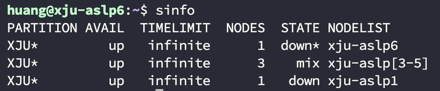

# 服务器维护文档
## 1. Slurm 使用指南

官网：http://slurm.schedmd.com

简介：是开源、具有容错性和高度可扩展大型和小型Linux集群资源管理和作业调度系统，可作为资源和作业管理，以避免相互干扰，提高运行效率。

### 1.1 基础概念

|      概念：       |                             简介                             |
| :---------------: | :----------------------------------------------------------: |
| 分区（PARTITION） | 分区就像是给节点分组，便于批量操作，实验室服务器由于机子不多，只分了一个分区：XJU |
|   节点（NODES）   | 节点是slurm调度的单位之一，每个节点是一个拥有计算资源的实体物理机，都有这台主机上搭载的资源，如CPU、磁盘、GPU等，实验室服务器目前有8台，分别命名为xju-aslp1-8 |
|   状态（STATE）   | 标识每个节点的状态，主要状态有：down：宕机；idle：空闲；mixed：混合，资源部分分配部分空闲；unknown/unk：未知原因 |

sinfo信息：



注：咱们一共8台服务器，但在不同机房，不在一个路由局域网，网络无法通信问题，实验室分为了两个slurm集群。

- Cluster1: [s1 s3 s4 s5 s6]
- Cluster2: [s7 s8]

这两个集群nfs服务无法相互通信，所以两个集群之间个人的用户目录磁盘数据是独立的。另外xju-aslp2不加入slurm集群，作为有特殊要求作业单独使用。

### 1.2 常用命令

```bash
# 1. 查看系统的分区、节点及其状态。
sinfo
# 2. 显示所有用户提交给slurm的作业列表。
squeue
# 3. 用于查找节点以及作业上的信息。
scontrol show [partition node job ]
# 4. 停止正在运行的作业，scancel jobid。如:
scancel 1000
# 5. 通过slurm登陆到其他节点，可以查看占用显存情况等。
srun -w xju-aslp1-8 -N 1 --ntasks-per-node=1 --pty bash --

```

### 1.3 作业提交方式

#### 常规的slurm提交作业命令

1）批处理作业（sbatch）

 采用sbatch命令提交，最常用方式，一般提交作业脚本，提交后立即返回该命令行终端，用户可进行其他操作。

 当作业被调度运行后，在所分配的首个节点上执行作业脚本，在作业脚本中可使用srun命令加载作业任务，或是其他shell命令。

 提交时采用的命令行终端终止，也不会影响作业的运行。

2）交互式作业提交（srun）

 资源的分配与任务加载均采用srun命令进行，当在登陆shell中执行srun命令时（是直接在命令行使用srun，而不是sbatch+作业脚本时），srun首先向系统提交作业请求，并等待资源分配，然后在所分配的节点上加载作业任务。

 采用该模式时，用户在该终端需等待任务结束才能继续其他的操作，在任务结束前断开命令行终端，则任务会被终止，所以一般用于短时间小作业测试。

3）分配模式（salloc）

 节点资源抢占命令，在用户提交作业前，抢占所需的计算资源。为需要实时处理的作业分配资源，典型的场景为分配资源并启动一个shell，然后利用此shell执行并行任务。salloc在申请成功后会返回申请到的信息，然后就可登录到申请的节点。

#### 推荐的提交作业方式

- 使用slurm.pl：上面常规的方式需要在作业脚本前写一堆配置很不方便，使用slurm.pl则可以省略这些工作，再加上一些简单的资源参数就可快速方便提交作业申请资源，而无需再管其他如time，mem等参数。每台服务器的/share和/s1-8home下都放了一个slurm.pl文件

  ```bash
  # slurm.pl的语法 :
  /share/slurm.pl --quiet --nodelist=$nodelist --gpu $gpu --num-threads $num-threads xx.log command
  ```


> - --quiet：隐藏slurm相关的log信息，避免太多无关log；
> - --nodelist=nodename：指定任务运行的节点，$nodelist可以为xju-aslp1-8；
> - --gpu：给当前任务分配多少个gpu，如果去掉这个参数默认为0个；
> - --num-threads：给单个任务分配多少CPU核心，默认为1个，建议使用gpu使每个gpu分配2个及以上cpu，但不要超过10个。
>
> xx.log为当前任务的输出日志，作业的输出以及报错都在这个.log文件内，command要运行的作业脚本或者shell命令

- slurm.pl结合sbatch：单独使用slurm.pl类似于srun，当用户在该终端需等待任务结束才能继续其他的操作，在任务结束前断开命令行终端，则任务会被终止。所以最建议的方式是：将所有要运行的命令写到一个run.sh脚本内，然后用sbatch提交这个run.sh脚本

  ```bash
  # sbatch的语法(这里的xx.log记录的是sbatch提交作业情况日志)
  sbatch --nodelist=nodename -o xx.log run.sh
  ```

- 一个例子：
  编写run.sh作业脚本：

  ```bash
  #!/bin/bash

  /share/slurm.pl  --quiet --nodelist=xju-alsp1 --gpu 1 --num-threads 2 train.log python train.py
  ```

  在终端使用sbatch提交作业脚本：

  ```bash
  sbatch  --nodelist=xju-aslp1 -o job.log run.sh
  ```

  这样作业就提交成功，可以通过job.log查看作业提交情况日志，train.log查看作业运行情况日志

- 提前占卡调试

  比如调试或者项目需要提前占用一张卡时，可以利用sbatch命令
  ```bash
  sbatch --nodelist=xju-aslpX -o sbatch.log --gres=gpu:1 --wrap='
      echo "=== 分配的 GPU 信息 ==="
      echo "CUDA_VISIBLE_DEVICES: $CUDA_VISIBLE_DEVICES"

      echo "slurm ID: $SLURM_JOB_ID"

      nvidia-smi -L
      nvidia-smi
      sleep infinity
  '
  ```

  这条命令会在节点X上申请一张显卡，并一直占着，sleep infinity表示sbatch运行了一条一直sleep的命令，当要用这张显卡时，不用slurm.pl或sbatch，直接用CUDA_VISIBLE_DEVICES提交到这张卡上就行（占用的是哪张卡的信息在sbatch.log里查看）。
